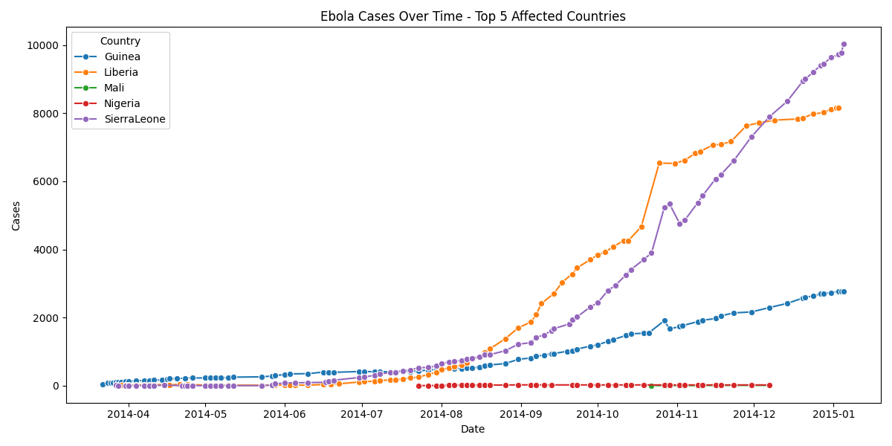
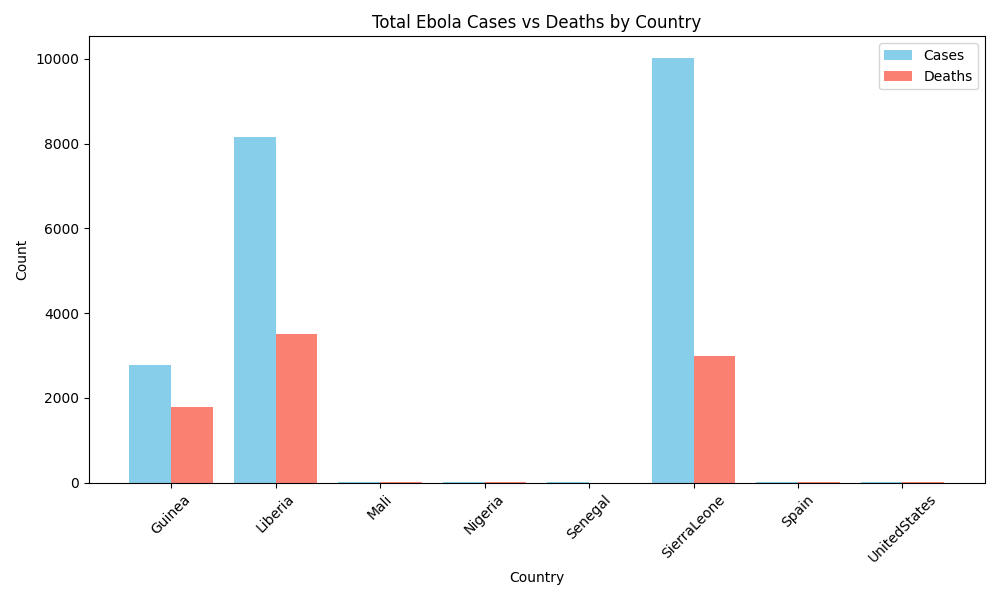

# datafun-03-analytics

This project organizes a Python-based data analysis workspace.

## Setup Instructions

1. Clone this repository:
   ```bash
   git clone https://github.com/teflxndxn/datafun-03-analytics.git
   cd datafun-03-analytics

##Create and activate your virtual environment:
python3 -m venv .venv
source .venv/bin/activate  # Mac/Linux
# .venv\Scripts\activate   # Windows
Install required dependencies:
pip install -r requirements.txt

##Push to Github:
git add .
git commit -m "your message"
git push origin main

# 📦 Project Setup and Requirements

This project is configured with a professional Python development workflow. It includes a `requirements.txt` file listing all external dependencies needed for data analysis, visualization, scientific computing, and Jupyter support.


---

## Getting Started

Follow these steps to set up your environment and install all required packages.

### Clone the repository

```bash
git clone https://github.com/your-username/your-repo-name.git
cd your-repo-name

Create and activate a virtual environment 
python -m venv venv

# On macOS/Linux:
source venv/bin/activate

# On Windows:
venv\Scripts\activate

Install dependencies from requirements.txt
pip install -r requirements.txt

#Included Dependencies

The requirements.txt file includes:

  NUMERICAL COMPUTING
numpy
  DATA ANALYSIS / DATAFRAMES
pandas
  STATISTICS / SCIENTIFIC COMPUTING
scipy
  VISUALIZATION
matplotlib
seaborn
 NETWORKING / HTTP
requests
  ENVIRONMENT VARIABLES
python-dotenv
 JUPYTER SUPPORT (If using notebooks)
jupyter
ipykernel

#Notes

Only external dependencies are listed in requirements.txt.
Standard Python libraries (like os, math, datetime) are part of the standard library and do not need to be listed.


## 🚀 **P3 Python Data Project**

# 🧪 Ebola Data Analytics Project

This project fetches, transforms, analyzes, and visualizes Ebola outbreak data across multiple countries. The goal is to derive insights about the spread and impact of the virus using Python, Pandas, Seaborn, and Matplotlib.

---

## 📁 Project Structure
datafun-03-analytics/
│
├── bless_data_project.py # Main script for the analysis
├── utils_logger.py # Logger configuration module
├── data/ # Contains input and output data files
│ ├── ebola_country_timeseries.csv
│ ├── ebola_summary_by_country.csv
│ ├── ebola_summary_by_country.xlsx
│ └── ebola_summary_by_country.json
│
├── ebola_cases_over_time.png # Line plot of Ebola cases over time
├── ebola_cases_vs_deaths.png # Bar plot of total cases vs deaths
└── README.md


---

## 📦 Setup Instructions

### 1. Clone the Repo
```bash
git clone https://github.com/your-username/datafun-03-analytics.git
cd datafun-03-analytics

 Create a Virtual Environment
 python3 -m venv .venv
source .venv/bin/activate  # On Windows: .venv\Scripts\activate
Install dependencies:pip install pandas matplotlib seaborn openpyxl
How to Run

Run the main Python script: 
python bless_data_project.py
This will:

Download the Ebola CSV data
Transform it into long format
Generate summary statistics (CSV, Excel, JSON)
Create and save two visualizations

📊 Visualizations





🧠 Insights
You can explore which countries had the most severe outbreaks.
Observe the time-based spread patterns.
Understand the difference between reported cases and fatalities.

🛠️ Technologies Used
Python 3
Pandas for data processing
Seaborn & Matplotlib for plotting
Logging for transparent execution tracking

🔗 Data Source
Ebola Data from GitHub - cmrivers/ebola


